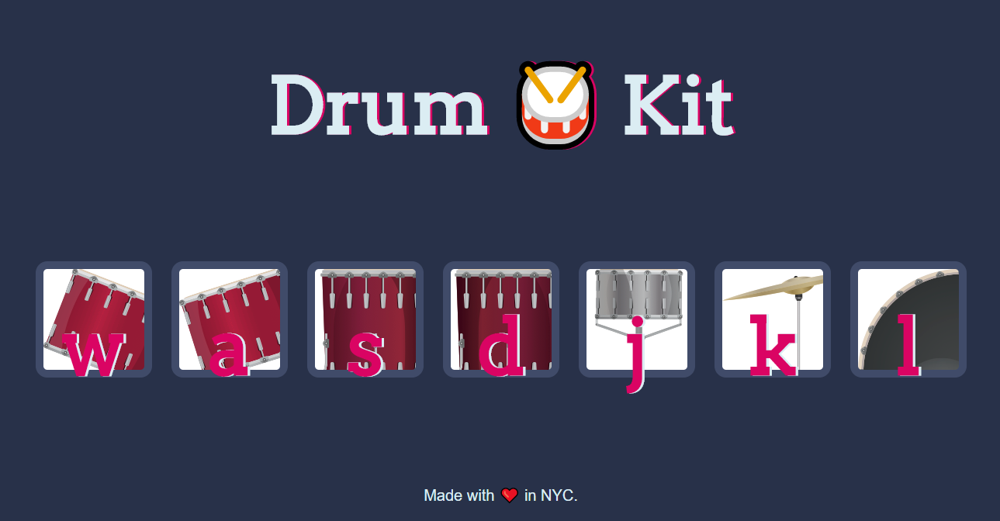

# drum-kit

> Assignment #3 in the 2020 Full-Stack Web Development Bootcamp by Dr. Angela Yu
___

### Table of Contents

- [Description](#description)
- [Usage](#usage)
- [Credits](#credits)
___

## Description

The goal of this assignment was to display images of musical instruments to the user. Then handle events such as clicking and keypress by the user to play sounds of the instruments displayed in the images. The HTML, CSS, sounds and the images were provided by the professor. Our main task was to create the logic of this challenge by writing Javascript.

#### Technologies Used:
- HTML
- CSS
- Javascript
- <a href="https://atom.io/">Atom</a>
___

## Usage
This project has no usage other than to present future employers of my progress as a Fullstack Web Developer. It will I hope serve other Udemy students solve their issues they encounter with their course.
___

## Credits
- Dr. Angela Yu
- Udemy
